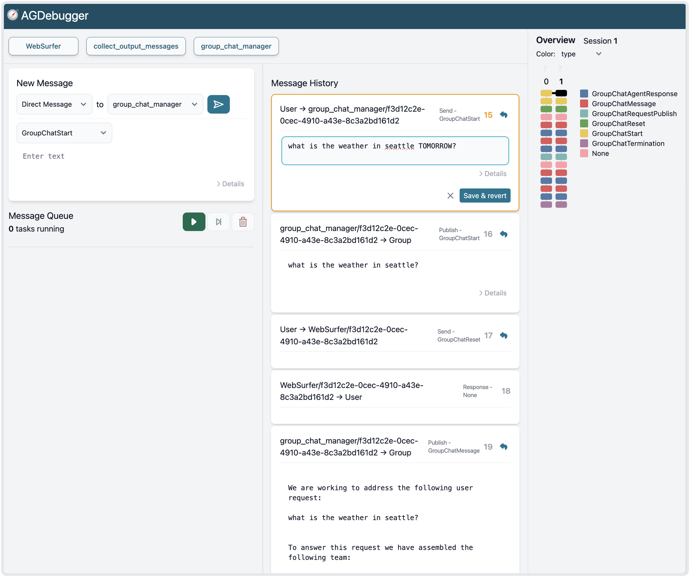

# AGDebugger

AGDebugger is an interactive system to help you debug your agent teams. It offers interactions to:

1. Send and step through agent messages
2. Edit previously sent agent messages and revert to earlier points in a conversation
3. Navigate agent conversations with an interactive visualization



## Local Install

You can install AGDebugger locally by cloning the repo and installing the python package.

```sh
# Install & build frontend
cd frontend
npm install
npm run build
# Install & build agdebugger python package
cd ..
pip install .
```

## Usage

AGDebugger is built on top of [AutoGen](https://microsoft.github.io/autogen/stable/). To use AGDebugger, you provide a python file that exposes a function that creates an [AutoGen AgentChat](https://microsoft.github.io/autogen/stable/user-guide/agentchat-user-guide/index.html) team for debugging. You can then launch AgDebugger with this agent team.

For example, the script below creates a simple agent team with a single WebSurfer agent.

```python
# scenario.py
from autogen_agentchat.teams import MagenticOneGroupChat
from autogen_agentchat.ui import Console
from autogen_ext.agents.web_surfer import MultimodalWebSurfer
from autogen_ext.models.openai import OpenAIChatCompletionClient

async def get_agent_team():
    model_client = OpenAIChatCompletionClient(model="gpt-4o")

    surfer = MultimodalWebSurfer(
        "WebSurfer",
        model_client=model_client,
    )
    team = MagenticOneGroupChat([surfer], model_client=model_client)

    return team
```

We can then launch the interface with:

```sh
 agdebugger scenario:get_agent_team
```

Once in the interface, you can send a GroupChatStart message to the start the agent conversation and begin debugging!

## Citation

See our [CHI 2025 paper](https://arxiv.org/abs/2503.02068) for more details on the design and evaluation of AGDebugger.

```bibtex
@inproceedings{epperson25agdebugger,
    title={Interactive Debugging and Steering of Multi-Agent AI Systems},
    author={Will Epperson and Gagan Bansal and Victor Dibia and Adam Fourney and Jack Gerrits and Erkang Zhu and Saleema Amershi},
    year={2025},
    publisher = {Association for Computing Machinery},
    booktitle = {Proceedings of the 2025 CHI Conference on Human Factors in Computing Systems},
    series = {CHI '25}
}
```
